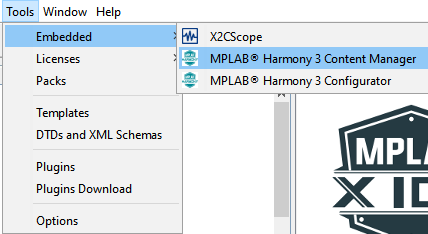
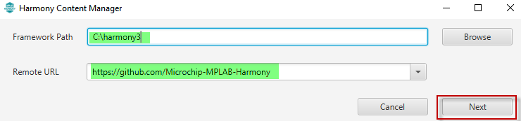
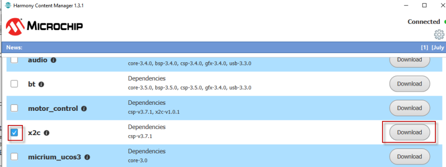
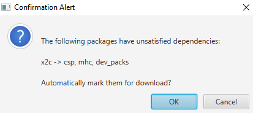
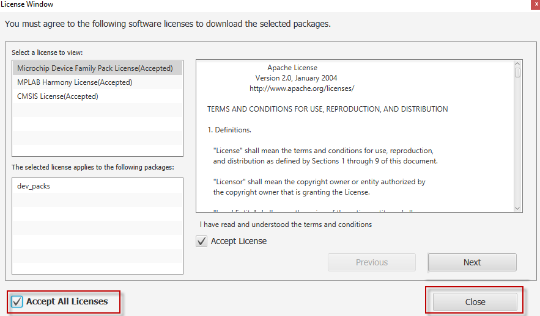

# Installing MPLAB® Harmony X2C Remote Package

## Pre-requisites
 - [MPLAB X IDE v5.40 or above](https://www.microchip.com/mplab/mplab-x-ide)
 - [XC32 v2.41 or above](https://www.microchip.com/mplab/compilers)
 - [Install MPLAB Harmony Configurator Plugin in MPLAB X](https://github.com/Microchip-MPLAB-Harmony/mhc/wiki#installing-mplab-harmony-configurator-from-the-microchip-plugins-update-center) 
 
## Install/update the latest revision of MPLAB Harmony X2C Remote Package
 - Open MPLAB X IDE
 - Go to Tools > Embedded > MPLAB Harmony Content Manager (MHCM)
    
 - Set Harmony 3 Installation Path and Installation Source
    
 - Scroll through the list of remote packages in MPLAB Harmony Content Manager and Select "x2c" and click Download 
    
 - If the required pre-requisite remote packages for "x2c" are not available, then MHCM would prompt you to download the pre-requisite remote packages - Select "OK"
    
 - Accept "all" licenses and click "Next"
    
 - If the required pre-requisite remote packages for "x2c" are not available, then MHCM would prompt you to download the pre-requisite remote packages - Select "OK" 
    
     
 
