# Create an X2C Model based "Bliky LED" demo in MPLAB® Harmony 3

This section provides a step by step guide to create an X2C Model based "Bliky LED" demo in MPLAB Harmony 3 running on [ATSAME54 Motor Control Plugin Module](https://www.microchip.com/DevelopmentTools/ProductDetails/PartNO/MA320207) + [dsPICDEM™ MCLV-2 Development Board (Low Voltage)](https://www.microchip.com/DevelopmentTools/ProductDetails/DM330021-2)

## Create and setup an X2C Model project in MPLAB Harmony 3
- Create ATSAME54P20A based MPLAB Harmony 3 Project
    - Open MPLAB X IDE -> File -> New Project -> "32-bit MPLAB Harmony Project" -> Set Harmony 3 Path -> Set Project Location, Folder Name and Project Name -> Set Configuration Name -> Select Target MCU - ATSAME54P20A
    
    <p>&nbsp;</p><p>&nbsp;</p><p>&nbsp;</p>  
 
 
- Open MPLAB Harmony Configurator
    - Go to Tools -> Embedded -> MPLAB Harmony Configurator -> Set MPLAB Harmony 3 Path -> Select the default Device Family and CMSIS Pack Paths
    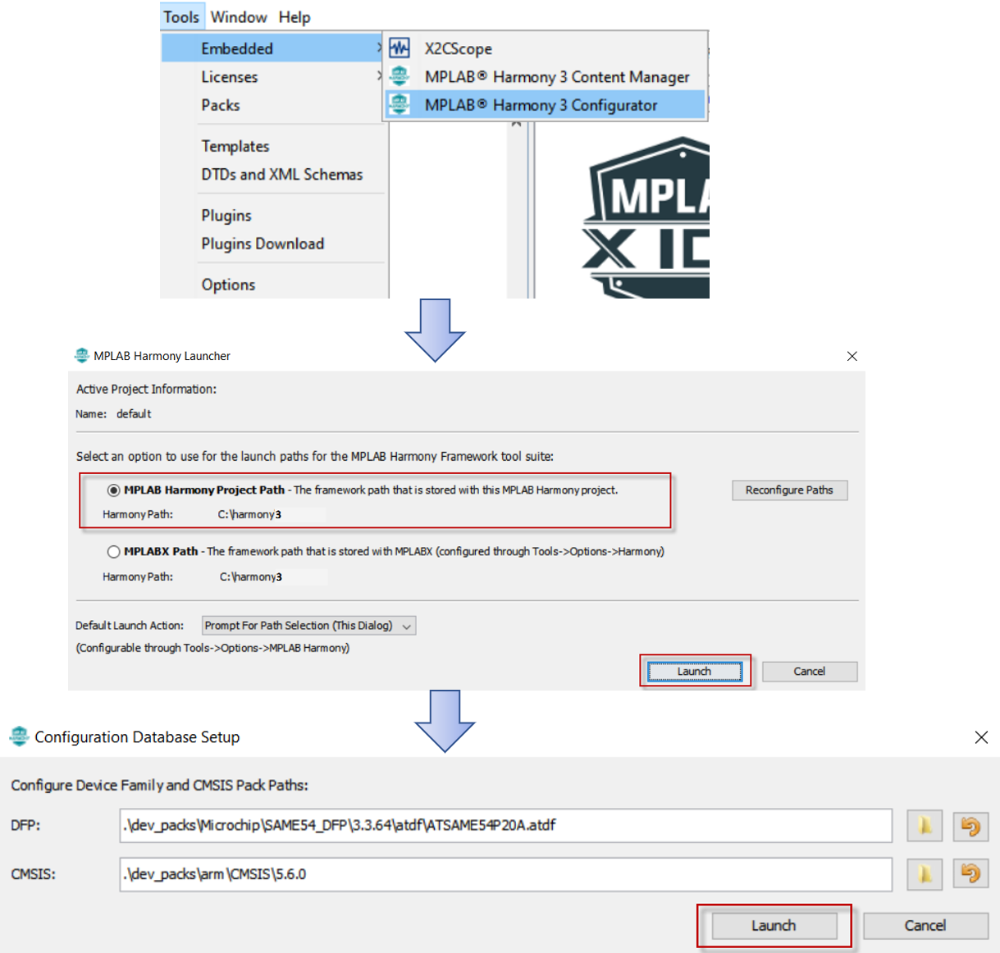
    <p>&nbsp;</p><p>&nbsp;</p><p>&nbsp;</p> 


- Add X2C Model from the list of Available Components -> X2C -> X2C Model into the project and connect the UART port on X2C Model component to the UART port on SERCOM2 component. This allows run time update to the X2C Model using X2C Communicator via UART channel of SERCOM2. Configure the recommended Baud Rate of 115200 bps using the X2C Model Component and set the "Receive Pinout" to SERCOM PAD[1]
   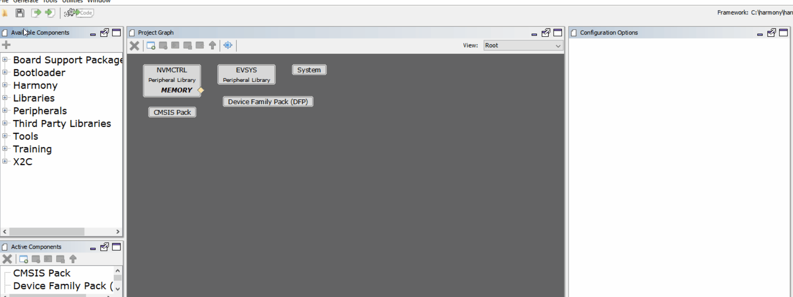
   <p>&nbsp;</p><p>&nbsp;</p><p>&nbsp;</p> 
   
 
 
 

 
- The control algorithm developed using X2C model is executed at a fixed interval which can be configured using a timer (TC0). Add TC0 to the project from the list of Available components -> Peripherals -> TC -> TC0
    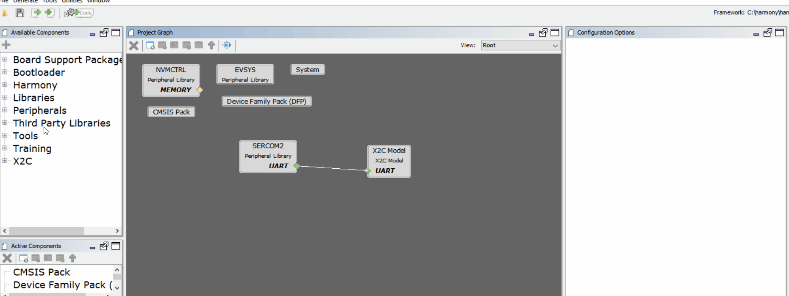
    <p>&nbsp;</p><p>&nbsp;</p><p>&nbsp;</p> 
    
    


- Configure the timer period of TC0 to match the rate of model execution. Also enable the period match interrupt. In this example, the timer period is set to 50uS.
    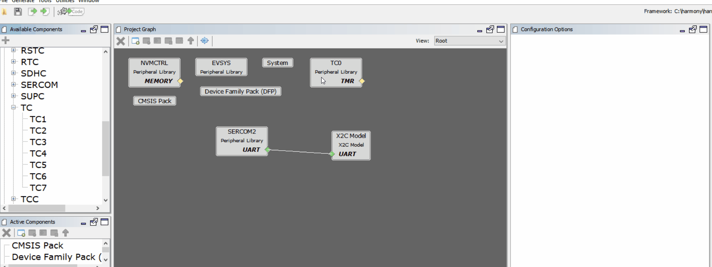
    <p>&nbsp;</p><p>&nbsp;</p><p>&nbsp;</p> 
    
    
    
    
    
- Configure I/O pins using Pin Configurator
    - Configure PD09 and PD10 as digital input for button switch BTN_S2 and BTN_S3
        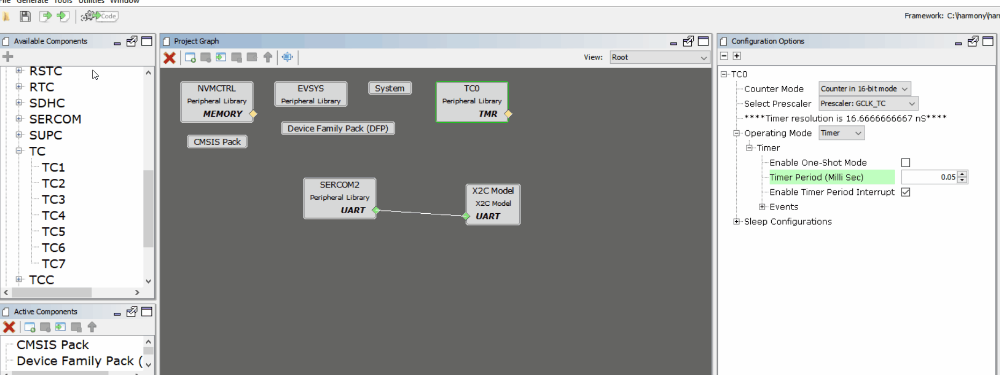
        <p>&nbsp;</p><p>&nbsp;</p><p>&nbsp;</p> 
        
        
        
        
    
    - Configure PB26 and PB27 as digital output for LED_D2 and LED_D17 respectively
        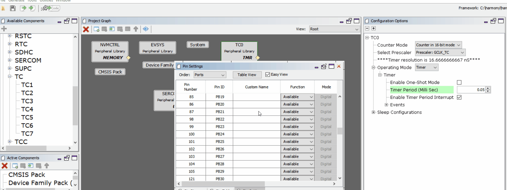
        <p>&nbsp;</p><p>&nbsp;</p><p>&nbsp;</p> 
        
        
        
        
   
    - Configure PA12 and PA13 as SERCOM2 PAD0 and PAD1 respectively
        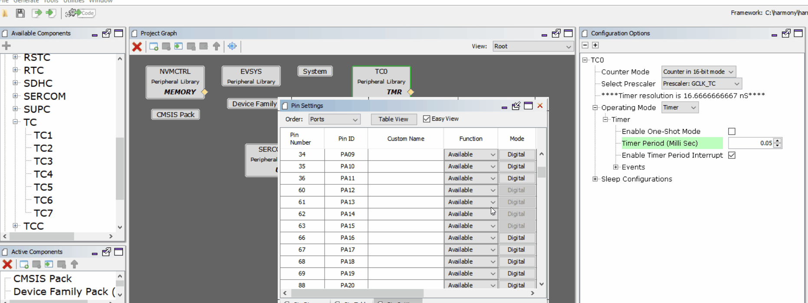
        <p>&nbsp;</p><p>&nbsp;</p><p>&nbsp;</p> 
        
        
        
        
        
- Generate Code
    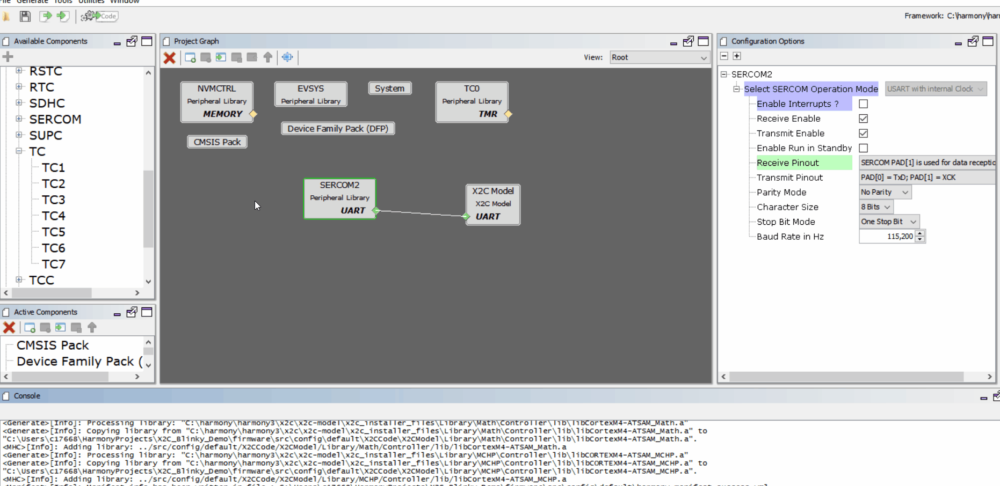
    <p>&nbsp;</p><p>&nbsp;</p><p>&nbsp;</p> 
    
    
    
    
    
## Establish communication between X2C Communicator and Target MCU 
- Open Scilab
    
    <p>&nbsp;</p><p>&nbsp;</p><p>&nbsp;</p> 
    
    
    
    
- Navigate to the project directory in Scilab where the MPLAB Harmony 3 Project was saved - <harmony 3 project path>\firmware\src\config\<config name>\X2CCode\X2CModel\
    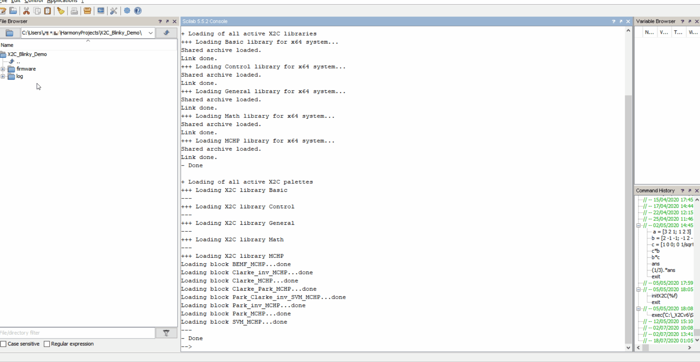
    <p>&nbsp;</p><p>&nbsp;</p><p>&nbsp;</p> 
    
    
    
    
    
- Generate code to configure X2C Communicator communication
    - Open basicModel.zcos 
    - Click on "transform model and push to communicator"  
    - Click on "Start Communicator"
    - Wait till you see "Model Set" in the log
    - Click on "Create Code" button
    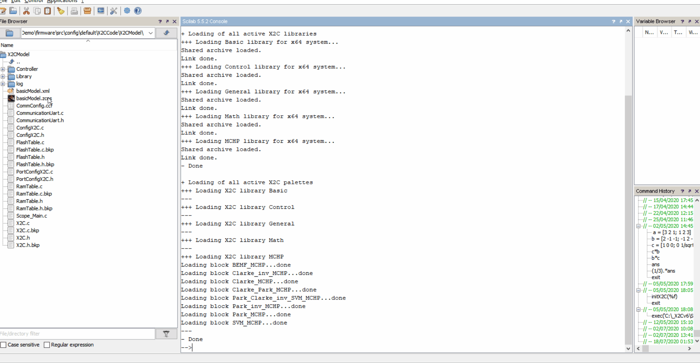
    <p>&nbsp;</p><p>&nbsp;</p><p>&nbsp;</p> 
    
    
    
    
    
- Add X2C Communicator API calls to MPLAB Harmony 3 Project
    - Add X2C_Communicate() API in while(1) loop in main.c
    - Add X2C_UpdateModel() API as a call back to TC0 period match interrupt
    - Start TC0 Timer
    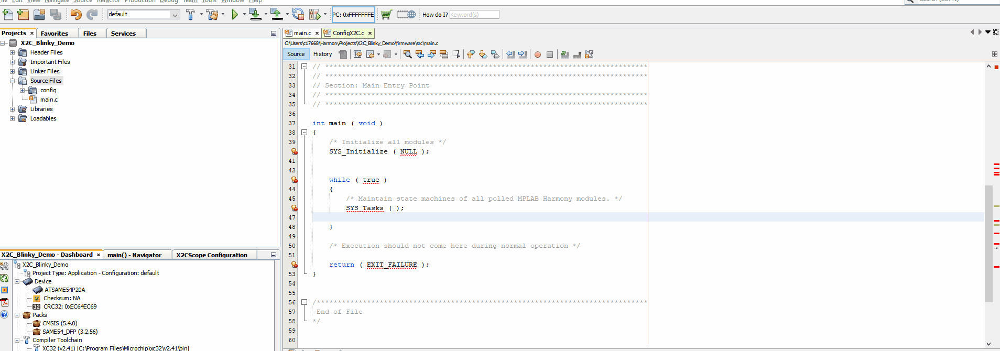
    <p>&nbsp;</p><p>&nbsp;</p><p>&nbsp;</p> 
    
    
    
    
    
- Make and Program Device Main Project
    
    <p>&nbsp;</p><p>&nbsp;</p><p>&nbsp;</p> 
    
    
    
    
    
- Verify X2C Communicator Communication
    - Click on "Start Communicator" (if not already open)
    - Setup Serial Port
    - Click on "Connect to Target"
    
    <p>&nbsp;</p><p>&nbsp;</p><p>&nbsp;</p> 
    
    
    

## Generate Code for Blinky LED model in Scilab/Xcos + X2C

- Save [`X2C_Blinky_LED.zcos`](X2C_Blinky_LED.zcos) at <harmony 3 project path>\firmware\src\config\<config name>\X2CCode\X2CModel\
- Close any open instances of X2C Communicator
- Open X2C_Blinky_LED.zcos in Scilab
- Click on "transform model and push to communicator"  
- Click on "Start Communicator"
- Wait till you see "Model Set" in the log
- Click on "Create Code" button
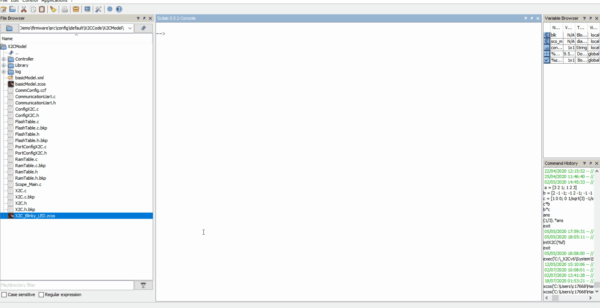
<p>&nbsp;</p><p>&nbsp;</p><p>&nbsp;</p> 


## Update "readInports" and "writeOutports" function calls in MPLABX Project

- Open "PortConfigX2C.c" from Source Files -> config -> <config name> -> X2CCode -> X2CModel
- Update readInports() as shown below

    ```
    void readInports(void)
    {
	/* TODO add linkage hardware-inputs -> X2C inports here 
     * Pass the peripheral values to model Inports
     * if (PORTA & 1) { 
     *    x2cModel.inports.bInport = INT16_MAX;
     * }else {
     *    x2cModel.inports.bInport = 0;
     * }
	 */
        if((*x2cModel.outports.bLED_D2))
        {
            LED_D2_Set();
        }
        else
        {
            LED_D2_Clear();
        }
        
        if((*x2cModel.outports.bLED_D17))
        {
            LED_D17_Set();
        }
        else
        {
            LED_D17_Clear();
        }
    }
    ```
    
- Update writeOutports() as shown below

    ```
    void writeOutports(void)
    {
     /* TODO add linkage hardware-inputs -> X2C inports here 
     * Pass the peripheral values to model Inports
     * if (PORTA & 1) { 
     *    x2cModel.inports.bInport = INT16_MAX;
     * }else {
     *    x2cModel.inports.bInport = 0;
     * }
	 */
        if((*x2cModel.outports.bLED_D2))
        {
            LED_D2_Set();
        }
        else
        {
            LED_D2_Clear();
        }
        
        if((*x2cModel.outports.bLED_D17))
        {
            LED_D17_Set();
        }
        else
        {
            LED_D17_Clear();
        }
    }
    ```

<p>&nbsp;</p><p>&nbsp;</p><p>&nbsp;</p> 


- Make and Program Device with MPLAB Harmony 3 project updated with Blinky LED model
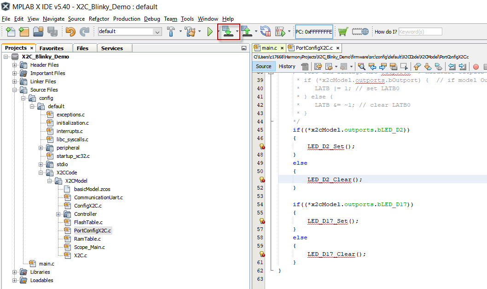
<p>&nbsp;</p><p>&nbsp;</p><p>&nbsp;</p> 


## Running the X2C_Blinky_LED demo

- Observe LED D2 turn ON when button switch S2 is pressed.

- Live update LED D17's blink rate using Scilab/Xcos + X2C
    - Ensure X2C Communicator is connected
    - Increase/Decrease Frequency input to Sin3Gen block to increase/decrease the LED D17's blink rate at run time
    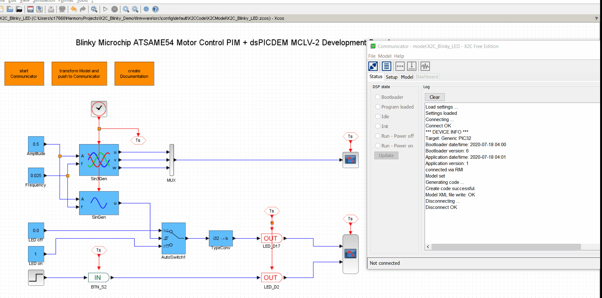
