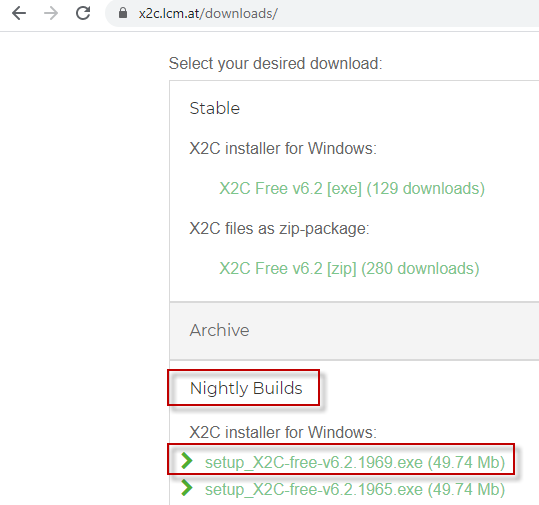
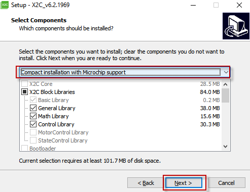
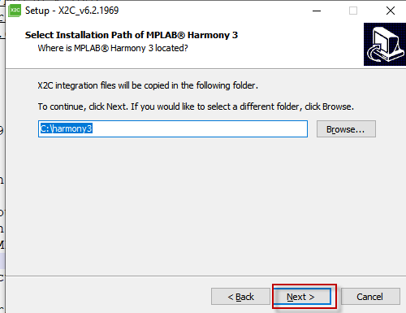

# Installing X2C Library

## Pre-requisites
 - [MPLAB® X IDE v5.40 or above](https://www.microchip.com/mplab/mplab-x-ide)
 - [XC32 v2.40 or above](https://www.microchip.com/mplab/compilers)
 - [MPLAB Harmony Configurator Plugin in MPLAB X](https://github.com/Microchip-MPLAB-Harmony/mhc/wiki#installing-mplab-harmony-configurator-from-the-microchip-plugins-update-center)
 - [MPLAB Harmony X2C Remote Package](../../installing_mh_x2c.md) 
 
## Install X2C Library

 - Visit this [link](https://x2c.lcm.at/downloads/) to download X2C v6.3 or above. 
 - If X2C v6.3 or above is not yet availabe, download X2C v6.2.1969 or above under "Archive -> Nightly Builds"
 
    
    
    
 - Run the X2C Installer and follow the instructions
 
 
 - At "Select Components" menu, select "Compact Installation with Microchip Support" and click "Next"
    
    
    
 - Certain library files from X2C are required to be copied to your local MPLAB Harmony 3 X2C installation folder. X2C Installer can do this task, transparent to the user, as long as the user provides the local Harmony 3 installation path as shown below. This step would copy the required library files at <harmony 3 directory>\x2c\config\x2c_installer_files\.
 
  **NOTE:** This is a important step which adds Scilab/Xcos + X2C model based development support in MPLAB Harmony 3 environment
 
   
    
    
 - Follow the rest of the self explanatory installation instructions to complete the installation of X2C.
 - X2C Installer will also download and install the requisite version of Scilab/Xcos (if not already installed)
 