# Add X2CScope to your MPLAB® Harmony 3 Application
This section provides a step by step guide to add X2CScope feature to ATSAMC21 based embedded application running on [ATSAMC21 Motor Control Plugin Module](https://www.microchip.com/DevelopmentTools/ProductDetails/PartNO/MA320206) + [dsPICDEM™ MCLV-2 Development Board (Low Voltage)](https://www.microchip.com/developmenttools/ProductDetails/PartNo/DM330021-2?utm_source=MicroSolutions&utm_medium=Article&utm_content=DevTools&utm_campaign=StandAlone)

 - Open ATSAMC21J18A based MPLAB Harmony Project to which X2CScope needs to be added.

 - Open MPLAB® Harmony Configurator using Tools > Plugin > MPLAB® Harmony Configurator

 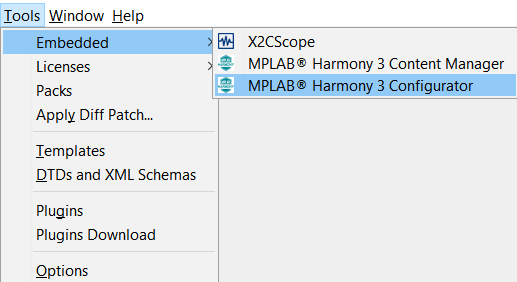

 - Just like in a real oscilloscope, the X2CScope also has a sampling rate at which the global variables are captured/updated. In this example, we will be using a fixed frequency timer event using TC1 to set the sampling rate.

 - Add TC1 from Available Components > Peripherals > TC into the Project

  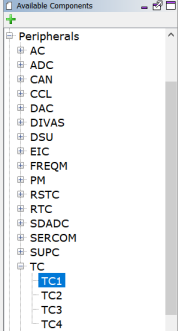

- Configure the timer period of TC1 to be same as sampling rate of the X2CScope. Also enable the period match interrupt. In this example, the timer period is set to 50uS.

    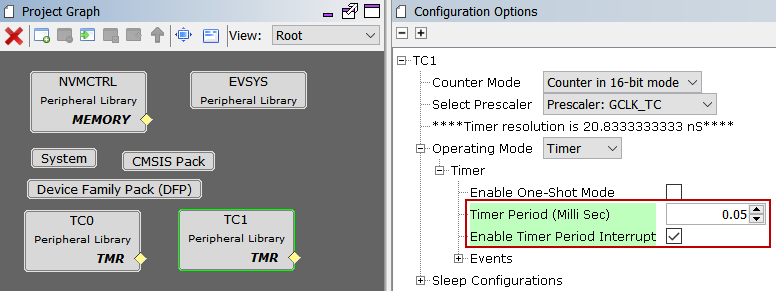

- X2CScope plugin communicates with the target MCU via UART. Add the appropriate UART channel which is mapped on the board to communicate with the host PC running the MPLAB X IDE. On [ATSAMC21 Motor Control Plugin Module](https://www.microchip.com/DevelopmentTools/ProductDetails/PartNO/MA320206) + [dsPICDEM™ MCLV-2 Development Board (Low Voltage)](https://www.microchip.com/developmenttools/ProductDetails/PartNo/DM330021-2?utm_source=MicroSolutions&utm_medium=Article&utm_content=DevTools&utm_campaign=StandAlone) hardware setup, SERCOM3 can be configured as a UART channel which can communicate with the host PC.

- Add X2CScope component into the project and connect the UART port on X2CScope component to the UART port on SERCOM3 component. This configures X2CScope to user UART channel of SERCOM3 to communicate with X2CScope plugin on the host PC. Configure the recommended Baud Rate of 115200 bps using the X2CScope Component

  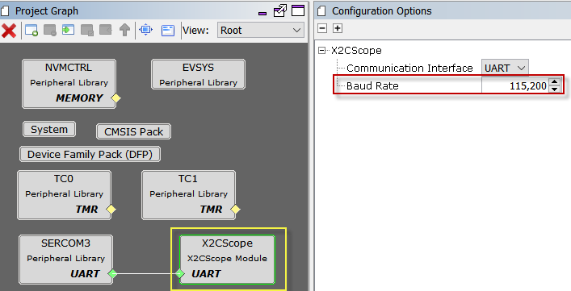

- Other than baud rate, following UART configurations are needed for establishing successful communication between target MCU and the host PC
  - Map the UART TXD and RXD signals (this configuration requirement may vary from MCU to MCU).In this example, TXD is mapped onto PAD[0] and RXD is mapped onto PAD[1]
  - Set Transmit and Receive enable
  - Disable UART Interrupts (disabled by default upon connecting X2CScope to the UART peripheral)
  - Parity Mode - None (set by default)
  - Character Size - 8 (set by default)
  - Stop Bit - 1 (set by default)
  - Baud Rate - Recommended to set at 115200 (configured by default upon connecting X2CScope to UART peripheral)
      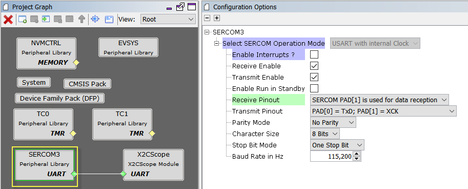

- Configure UART TX and RX pins using IO Pin Manager - MHC > Tools > Pin Configuration. In this example, PA22 is configured as SERCOM3_PAD0 [mapped as TXD] and PA23 is configured as SERCOM3_PAD1[mapped as RXD]

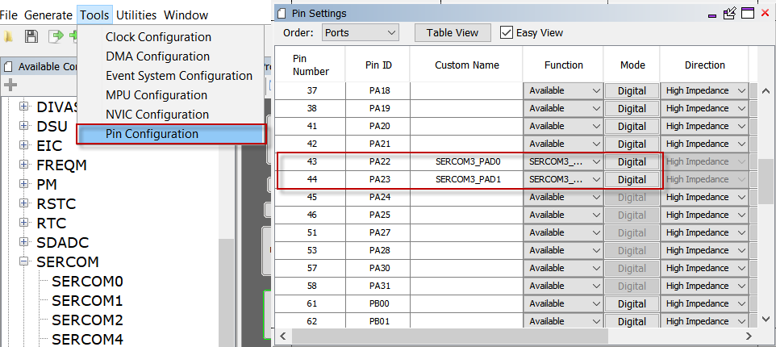

- Generate Code

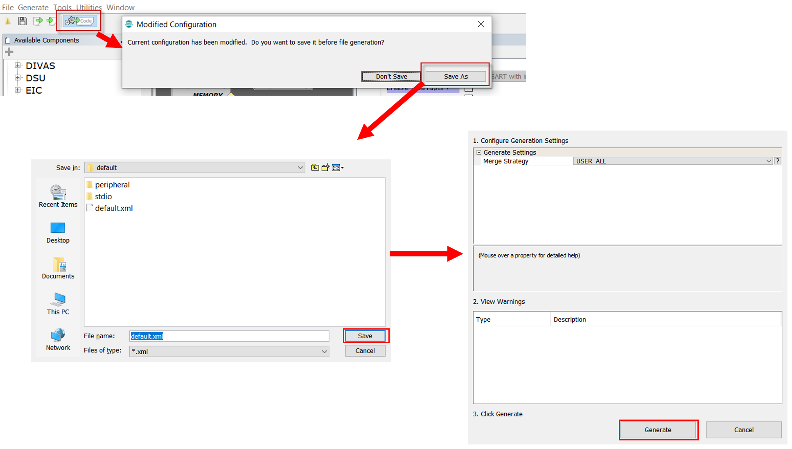

- Adding X2CScope APIs
  - Open <code>main.c </code>
  - Add <code>X2CScope_Communicate()</code> function call within the while(1) loop in the main function. This API establishes communication between the target MCU and the X2CScope plugin on the host PC.

    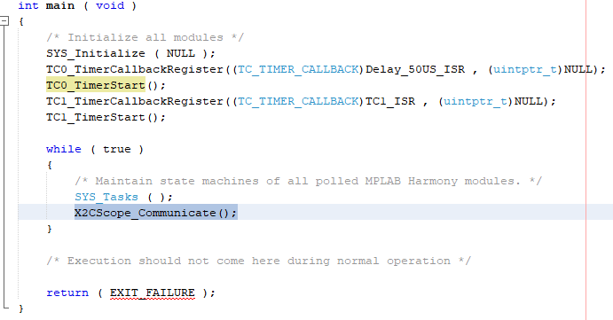

  - <code>X2CScope_Update()</code> API samples the desired global variables. In order to sample the variables at a fixed rate (sampling rate), this API needs to be executed at the same rate as desired sampling rate. Typically, a timer is used to generate accurately timed interrupts which executes this API. In this example, TC1 is used to generate the sampling events and hence the <code>X2CScope_Update()</code> API is added in TC1 Interrupt Service Routine

    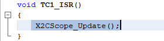  

- Enable symbol loading in MPLAB X guide
  - Go to File > Project Properties > Loading > Enable "Load symbols when programming or building for production (slows process)"
    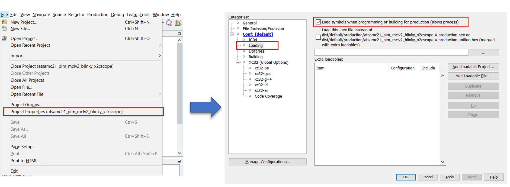

- Clean Build the project

  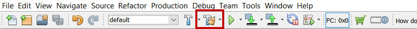

- Program the project into the target MCU

  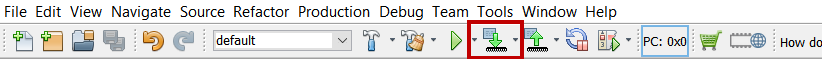

# Running X2CScope

- Launch X2CScope plugin : Tools > Embedded > X2CScope

  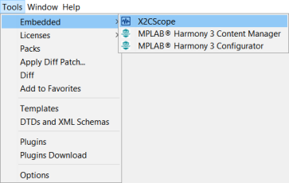

- Connecting X2CScope
    - Connection setup
      - Select relevant MPLAB X Project
      - Set Baud Rate same as UART channel - 115200 (recommended)
      - Set Data bits - 8
      - Set Parity - None
      - Select relevant COM Port

  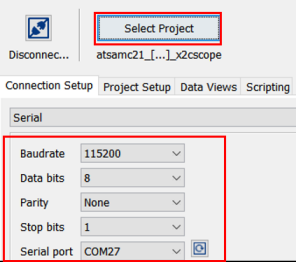

    - Project setup
      - Set Scope Sample time to match timer period which executes <code>X2CScope_Update()</code> at a fixed rate
      - Set Watch Sample time
      - Click on "Set Values"

  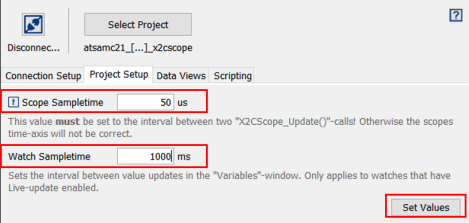

    - Establish Connection by connecting "Disconnect/Connect" Toggle button

     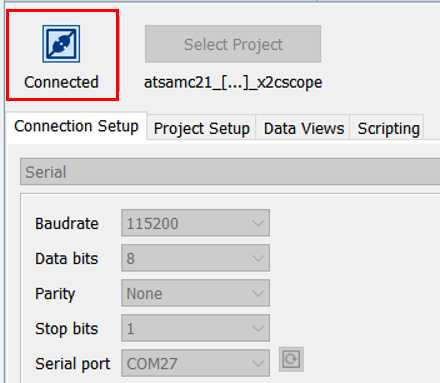

    - Using Scope View

     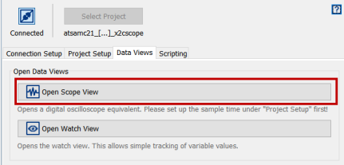

     - Add the desired global variable to the corresponding channel and click "Sample"

    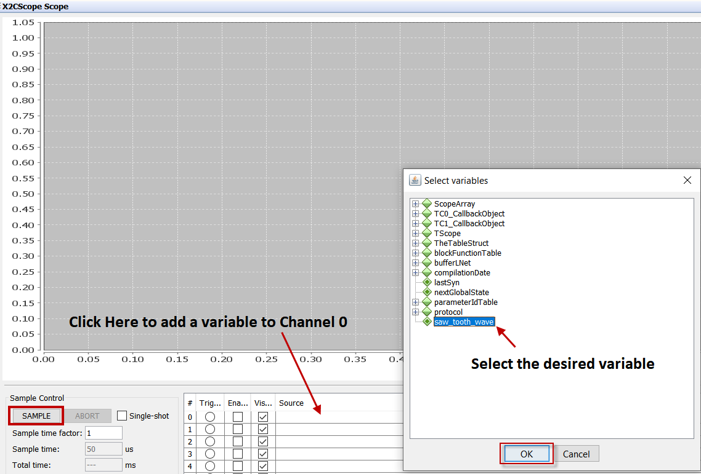

        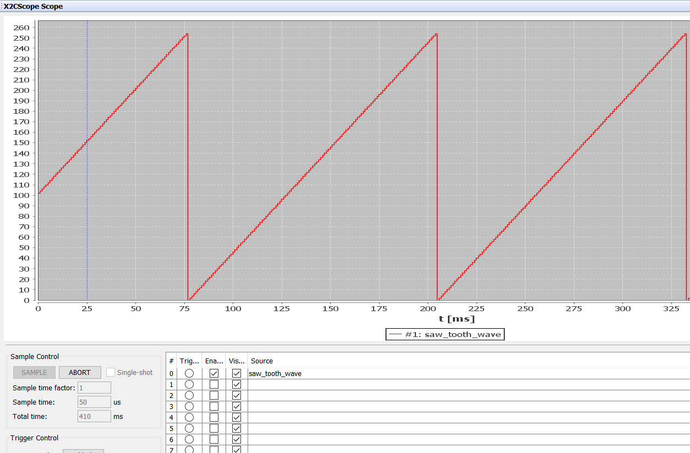

    - Using Watch View
      - Click on "Watch View" under "Data Views" tab.
      - Click on "+" button to add the global variables to be watched

      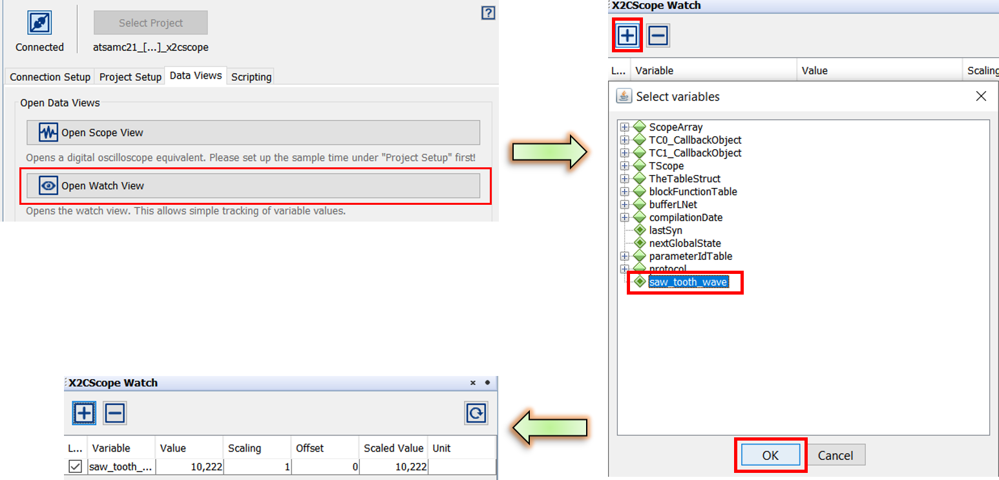
