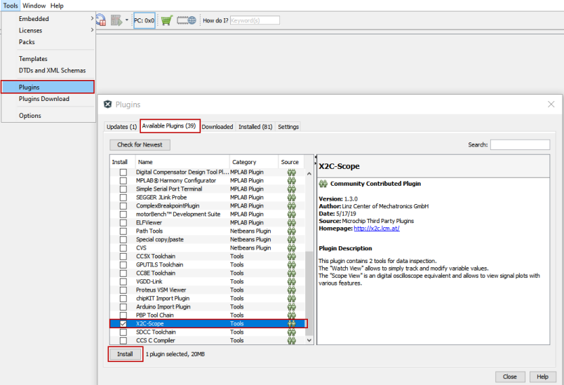
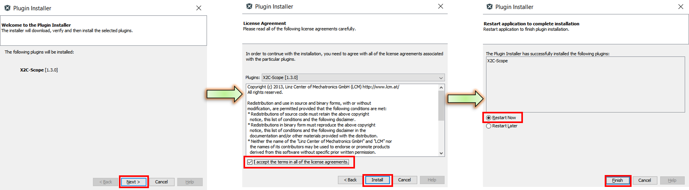

# Installing X2CScope plugin in MPLAB® X IDE
X2CScope comes as an MPLAB® X plugin which can be installed using the Plugin Manager.

- Open MPLAB® X IDE
- Go to Tools > Plugins > Available Plugins
- Select X2CScope plugin and click "Install"

- Follow the subsequent installation instructions.
- In order to complete the installation MPLAB® X IDE needs to be restarted

